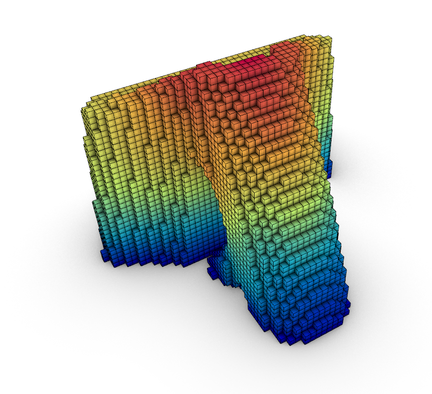
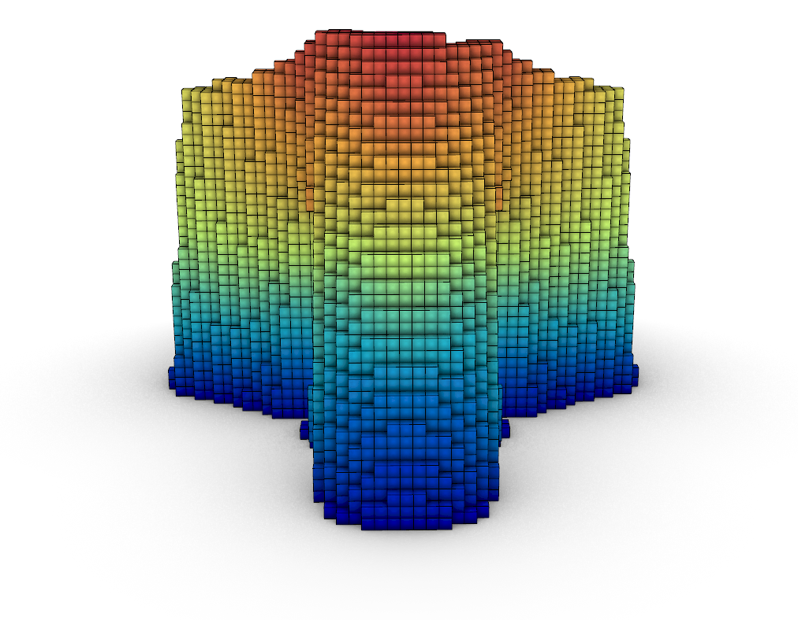
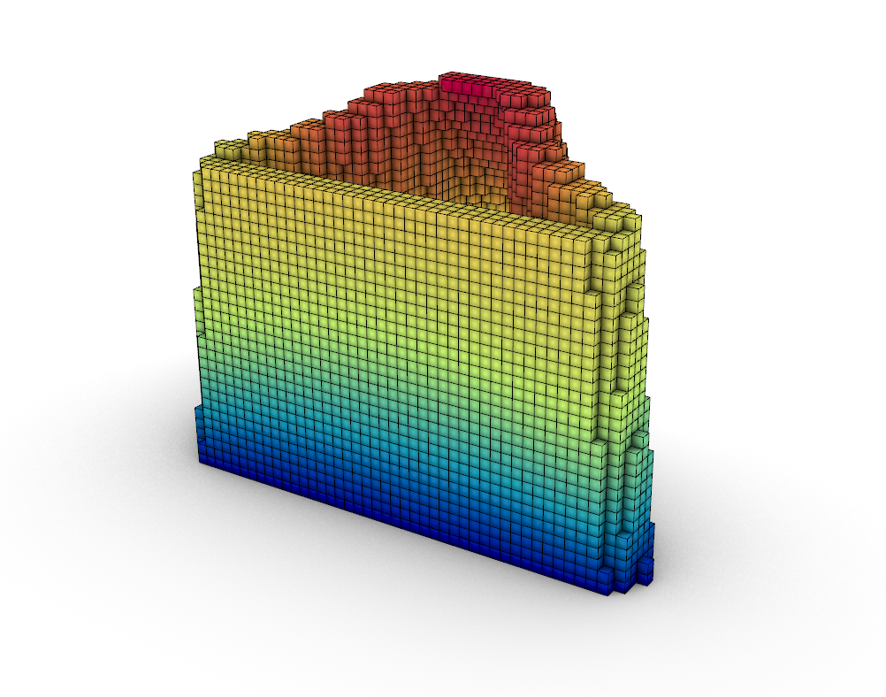

# 3d Printed Structure

The grasshopper script shows how to analyse step by step a 3d printed structure with the use of Brick elements and analyse them with the help of **Alpaca4d**. 

The grasshopper script requires <a href="https://www.food4rhino.com/en/app/concre3dlab">Voxel Print plug-in</a>.

Script created by <a href="https://github.com/Marco-Pellegrino/">Marco Pellegrino</a> 

