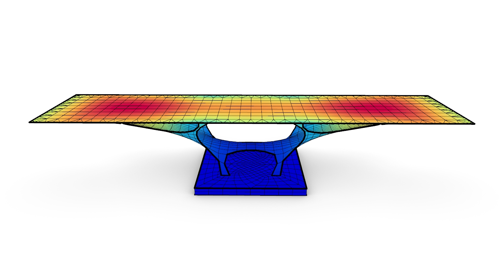
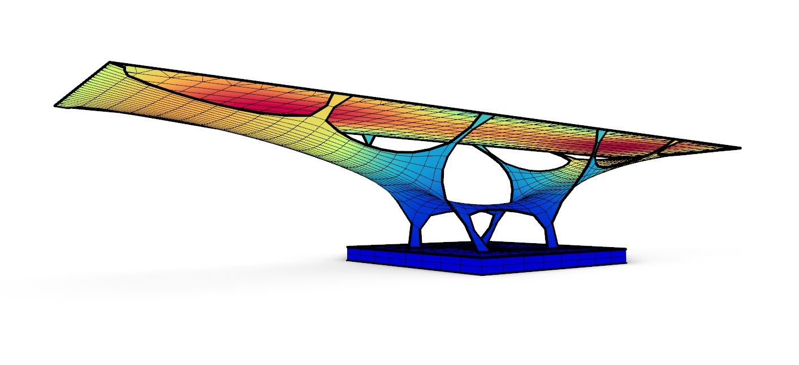
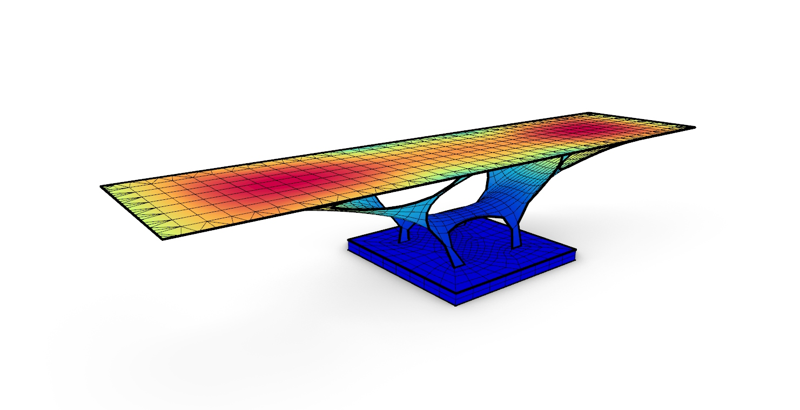

# Musmeci Bridge

The grasshopper script shows how to create with form-finding technique the Musmeci Bridge and how to analyse the structural behaviour with the use of **Alpaca4d**. 
The grasshopper script requires <a href="https://www.food4rhino.com/en/app/iguana-mesh">Iguana Mesh</a>.

Script created by <a href="https://github.com/Marco-Pellegrino/">Marco Pellegrino</a> 

