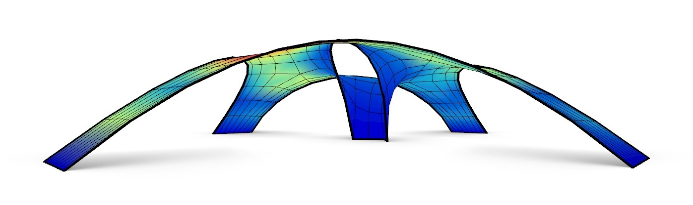
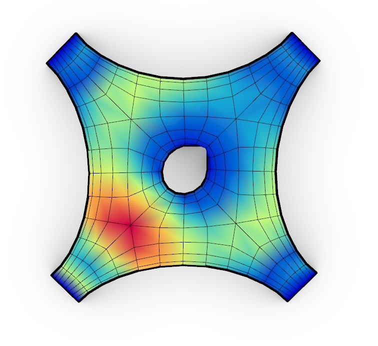
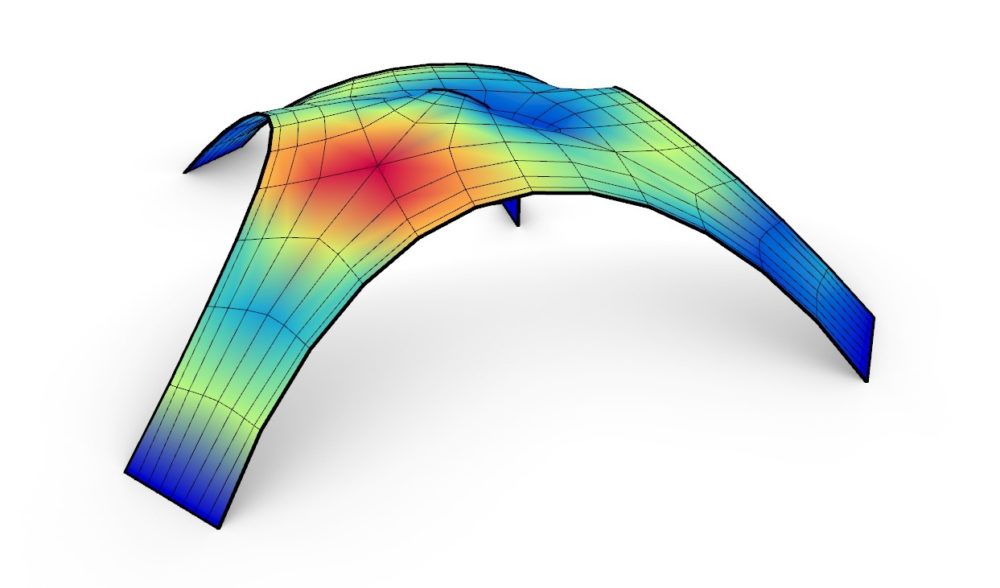

# Free Form Structure

The grasshopper script shows how to perform a form-finding in order to find a shell that works purely in compression with the use of Kangaroo2 and to analyse the structural behaviour with the use of **Alpaca4d**.

Script created by <a href="https://github.com/Marco-Pellegrino/">Marco Pellegrino</a> 

