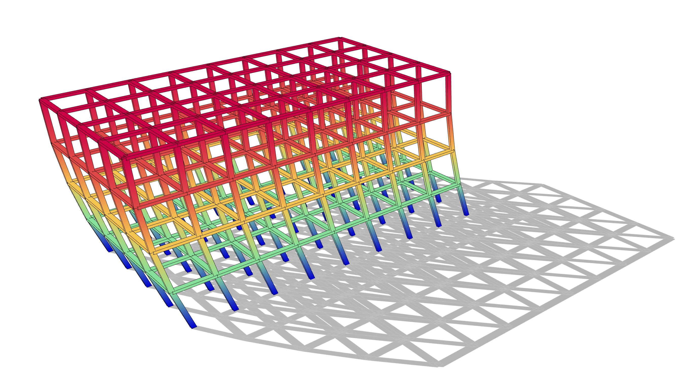
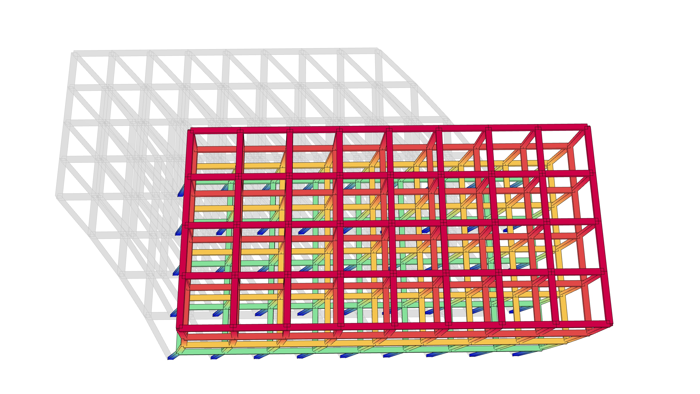
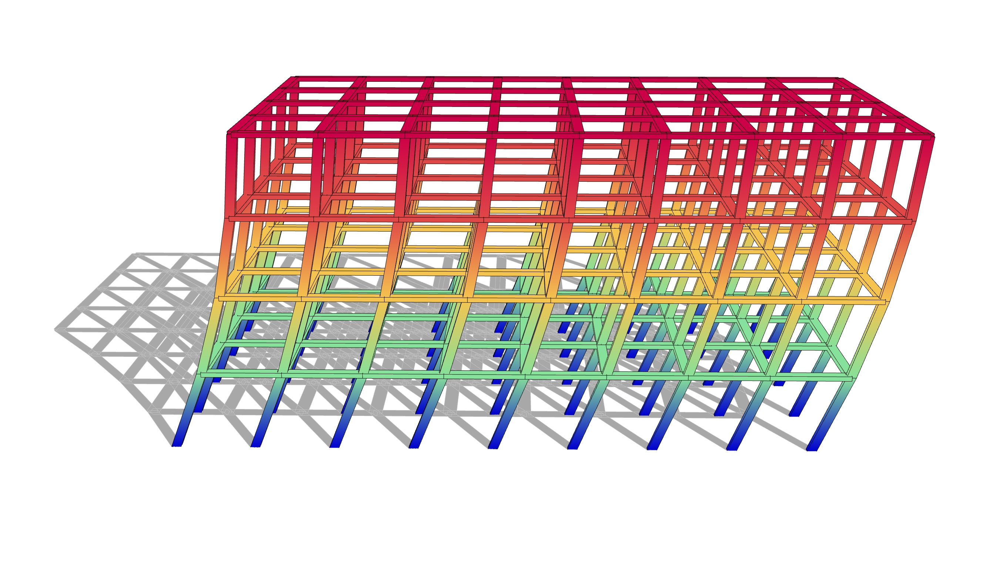

# Musmeci Bridge

The grasshopper script shows how to develop a parametric model of a Multi-Storey Building and how to analyse the structural behaviour with the use of **Alpaca4d**. 
Several parameters have been implemented such as:
<ul>
	<li>Width, Depth of the building</li>
	<li>Beam's Span in direction X - Y</li>
	<li>Number of floors</li>
	<li>Height of each floor</li>
	<li>Concrete core position</li>
	<li>Cross Braced position</li>
</ul>

Script created by <a href="https://github.com/Marco-Pellegrino/">Marco Pellegrino</a> 

